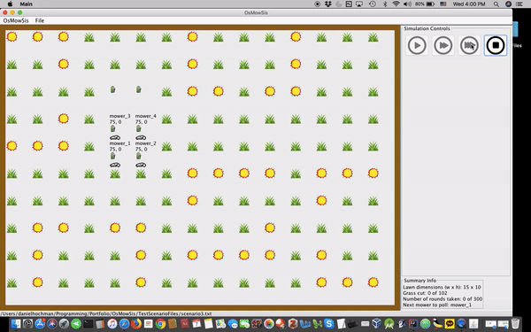

# OsMowSis
Welcome to OsMowSis!


## Overview
OsMowSis is an automated lawn-mowing system whereby a cohort of robotic lawn mowers is placed on a lawn and must scan and move around the lawn in order to cut all the grass, while also avoiding crashing into various types of obstacles on the lawn. At the start of each simulation run, the lawn mowers knows nothing about the lawn they have been placed on; they *must* issue scan requests (which return to the lawn mower the contents of the squares adjacent to it) and formulate lawn-mowing strategies accordingly. The lawn consists of squares that may contain one of: {GRASS, EMPTY, CRATER, ENERGY, FENCE, MOWER}. Each simulation run is configured based on a scenario file which contains information such as the lawn layout, number and location of entities on the lawn, and lawnmower starting energy level, etc. Once a scenario file has been read in and the simulation scenario has been properly configured, the user may control the simulation using the buttons on the "Simulation Controls" panel. Simulation stats appear in the "Summary Info" panel and will also be presented to the user in a dialog box upon completion of a simulation run.

The goal of this project was to apply object-oriented analysis and design to a problem and ultimately engineer a viable software solution. Further, this project allowed for the exploration of several alternative architectural solutions and hands-on experience following an agile methodolgy in order to build a working software product incrementally.

This project was written in Java using the Swing GUI toolkit.

Short video demonstration available [here](https://youtu.be/65dBQBcDRs4).

<strong>Note that this is the public home page for the OsMowSis project, which is a private repository. In order to access the actual private repository and the project's source code, please log into this GitHub account (potentialEmployer77) using the login credentials provided at the top of my resume.</strong>

## Simulation rules
### The lawn
A relatively simple and straightforward model of the lawn serves as the basis for the simulation. Namely, the lawn is modeled as a rectangular grid, and further divided into uniform-sized squares much like a chessboard. Each square (by default) contains grass that needs to be cut, unless it contains an obstacle or some other artifact (i.e. a crater). Craters are static, and do not move or otherwise change locations during a simulation run. A square that contains a crater will not contain any grass. If a square contains a crater, then the lawnmower must avoid that square – entering the square will cause that mower to “crash”, which prevents that mower from performing any more actions during the simulation run.
### The lawnmowers
Each lawnmower is assigned a unique mower ID, determined by the order that the mower is listed in the scenario file: the first mower is mower_1, the second mower is mower_2, etc. Each lawnmower occupies exactly one square of the lawn at any one time. If a mower attempts to move into (or through) the square currently occupied by another mower, then the mower that attempted the move will be “stalled” for a certain number of turns (as specified in the scenario file). Each lawnmower is also pointed in one specific direction at a time. A lawnmower is allowed to point to any of the adjacent squares, horizontally, vertically or diagonally. When moving, a lawnmower must first move forward zero, one or two squares, and then may reorient itself to a different direction (or maintain the same direction). A lawnmower will cut the grass of any of the squares that it occupies, or passes across successfully. By the same token, if a lawnmower attempts to occupy or pass over a square with a crater, then the lawnmower crashes and is removed from the lawn for simulation purposes (but the crater remains). Also, if a lawnmower attempts to move outside of the lawn at any time, then that will be counted as a crash with the surrounding fence, and the mower is similarly removed from the lawn. The simulation run must halt if all of the lawnmowers have crashed.

At the start of the simulation, each mower knows:
* Its unique “identifier” (modeled as a simple, unique integer – 1, 2, 3, etc.)
* The total number of mowers in the group
* Its original orientation (direction)

At the start of the simulation, each mower does NOT know:
* Its “absolute location” with respect to the lawn
* The width or height of the lawn
* The quantities or absolute locations of any of the obstacles o The locations (absolute or relative) of the other mowers

The mowers are allowed to share data with each other using a persistent, shared communication channel. As each mower scans the lawn and learns more about its surroundings, it is allowed to combine its accumulated knowledge with the other mowers.

Each mower has the same (maximum) energy capacity, measured in generic “units.” The energy capacity is given as an input value in the scenario file. The current energy value for each lawnmower appears in the UI as the first (leftmost) number directly under the mower ID (the second number is the number of rounds the lawnmower is currently stalled for). The starting square for each mower also contains a recharging pad. Any mower that stops on this pad will be fully recharged at the end of its action. A mower that passes over the pad while moving two squares will NOT be recharged. Finally, recharging pads don’t move (static locations). If a mower runs out of energy while away from a recharging pad, it stalls and is immobilized for the remainder of the simulation run. Unfortunately, it also remains on the lawn as an obstacle to the other (still active) mowers.

Mowers expend energy based on their actions:
* Move zero squares or scan: 1 unit of energy will be expended
* Move one or two squares: 2 units of energy will be expended
### The simulation
The simulation run is conducted as a discrete-event simulation, where the simulation begins by reading in a scenario/test file that contains the following information:

1. the width (horizontal/X-direction) of the lawn
2. the height (vertical/Y-direction) of the lawn
3. the number of lawnmowers being used
4. the mower “collision delay”: the number of turns stalled if it collides with another mower
5. the (individual) mower energy capacity
6. the initial location and direction of each lawnmower [one line per lawnmower]
7. the number of craters on the lawn
8. the location of each crater [one line per crater]
9. the maximum number of turns for the simulation
  
For fairness, a lawnmower should never be started on a crater, nor should it be completely surrounded by craters and/or fencing in its initial position. Also, there should not be sections of the lawn that are completely surrounded by craters or fencing – all grass squares should have an accessible route.

The simulation system keeps track of the number of rounds that have been executed so far, where a round is defined as the opportunity for each mower to execute a single action. During a single round, the simulation system allows each lawnmower to perform one action in a round-robin format based on the order of the mowers as listed in the scenario file. The mowers perform their actions individually, not concurrently.

During each round of the simulation run, each lawnmower has the opportunity to select its next action. A lawnmower has two possible actions on any given turn:

(1) move (go forward zero, one or two squares, and then [optionally] change direction); or,
(2) scan its surroundings.

If a lawnmower selects option (1), then the lawnmower should move forward zero, one or two squares, and is then allowed (optionally) to reorient its direction. A lawnmower must move first and then reorient its direction – it cannot change direction and then move forward in the same action. Option (2), however, gets to the heart of the “automated” nature of the problem: the lawnmowers don’t have any specific initial knowledge of the lawn that they have been tasked with mowing. A major design constraint of this simulation system is that the lawnmowers have to learn about the lawn as they perform their mowing tasks. To do this, a lawnmower is permitted to scan its surroundings and receive information about the eight squares that are adjacent to its current location. The scan returns information about the state of the surrounding squares as “grass”, “crater”, “mower”, “empty” or “fence” (which means “off the lawn”) to that mower.

Basically, the simulation system does four main things:

(1) read in the input file;
(2) setup the initial state of the simulation run;
(3) monitor the actions of the mowers and update the state of the simulation appropriately; and, 
(4) halt the simulation run at the appropriate time.

The simulation run continues until either: (a) all mowers have crashed; (b) the maximum number of rounds (as permitted in the scenario file) has been reached; or, (c) all grass has been cut.

Once the simulation run has been halted, the system reports the total number of squares on the lawn, the total number of grass squares that originally existed on the lawn, the actual number of grass squares that were cut, and the total number of rounds that were taken.


## Welcome to GitHub Pages

You can use the [editor on GitHub](https://github.com/potentialEmployer77/OsMowSisHome/edit/gh-pages/index.md) to maintain and preview the content for your website in Markdown files.

Whenever you commit to this repository, GitHub Pages will run [Jekyll](https://jekyllrb.com/) to rebuild the pages in your site, from the content in your Markdown files.

### Markdown

Markdown is a lightweight and easy-to-use syntax for styling your writing. It includes conventions for

```markdown
Syntax highlighted code block

# Header 1
## Header 2
### Header 3

- Bulleted
- List

1. Numbered
2. List

**Bold** and _Italic_ and `Code` text

[Link](url) and 
```

For more details see [GitHub Flavored Markdown](https://guides.github.com/features/mastering-markdown/).

### Jekyll Themes

Your Pages site will use the layout and styles from the Jekyll theme you have selected in your [repository settings](https://github.com/potentialEmployer77/OsMowSisHome/settings). The name of this theme is saved in the Jekyll `_config.yml` configuration file.

### Support or Contact

Having trouble with Pages? Check out our [documentation](https://docs.github.com/categories/github-pages-basics/) or [contact support](https://github.com/contact) and we’ll help you sort it out.
